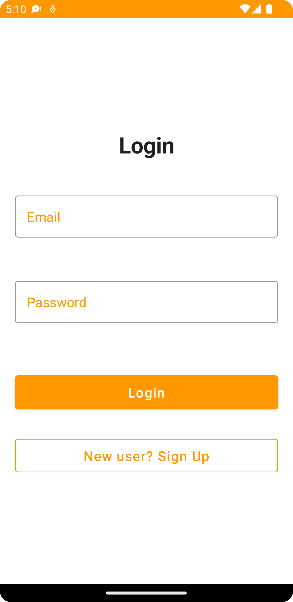
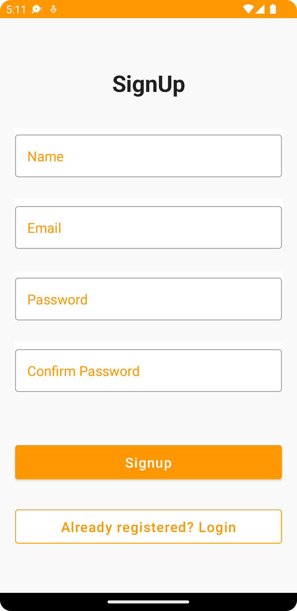
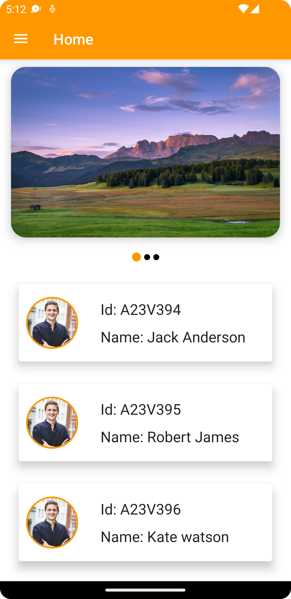
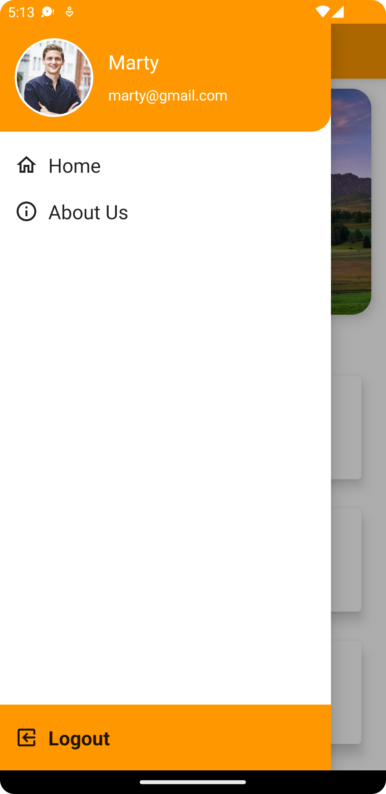

# Jetpack_compose_demo_master
A Demo project of Jetpack compose UI with MVVM architecture. This app contains below pages.
1. Login
2. Signup
3. Home
4. Drawer
5. About us(Webview)

## Dummy Credentials
Below are dummy credentials.you can create your own credentials by registering yourself.
.Email:- marty@gmail.com
.Password:- 123456

## Screenshots

Login

SignUp

Home

Drawer

WebView
A demo url of Dainik bhasker is added for dummy view.

